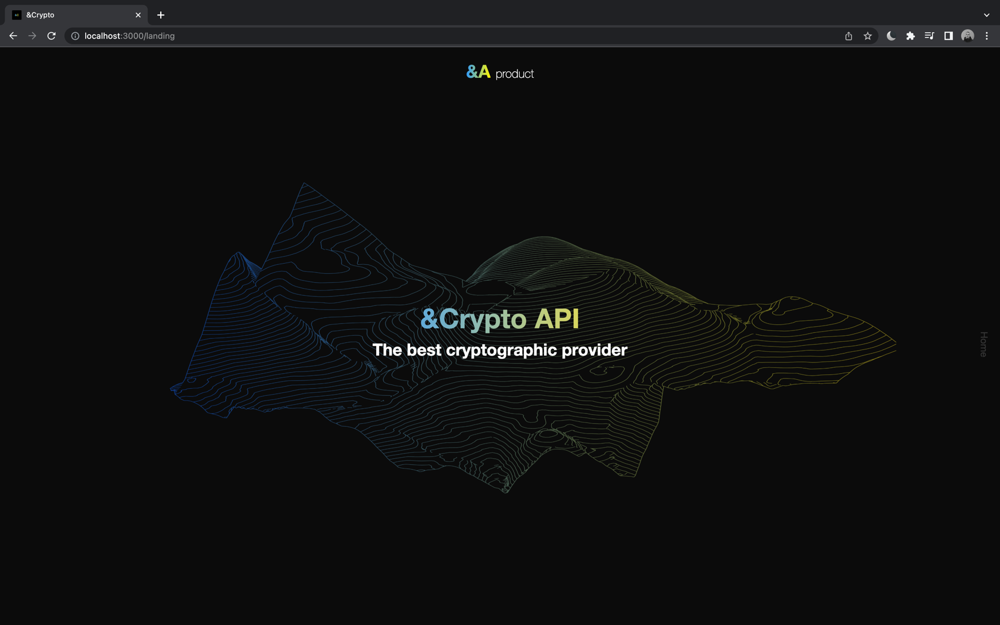
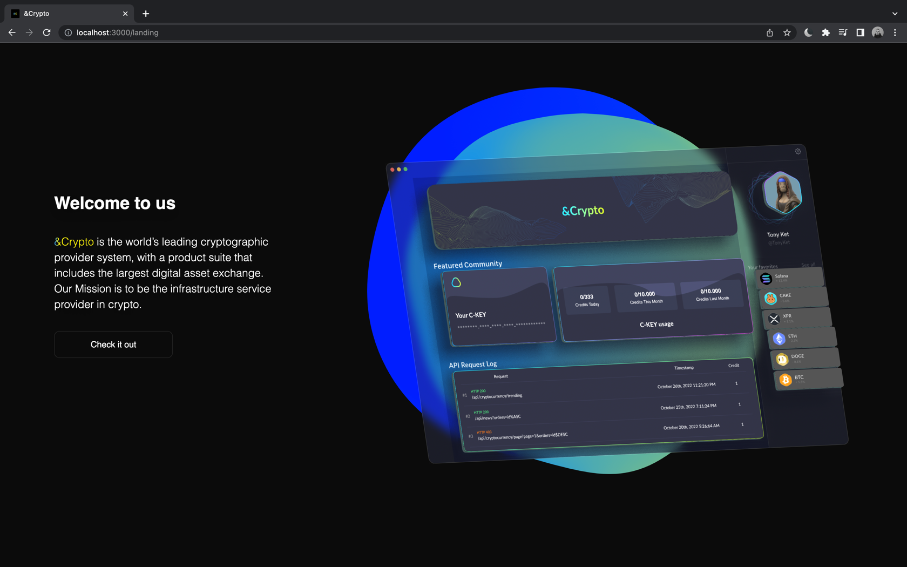
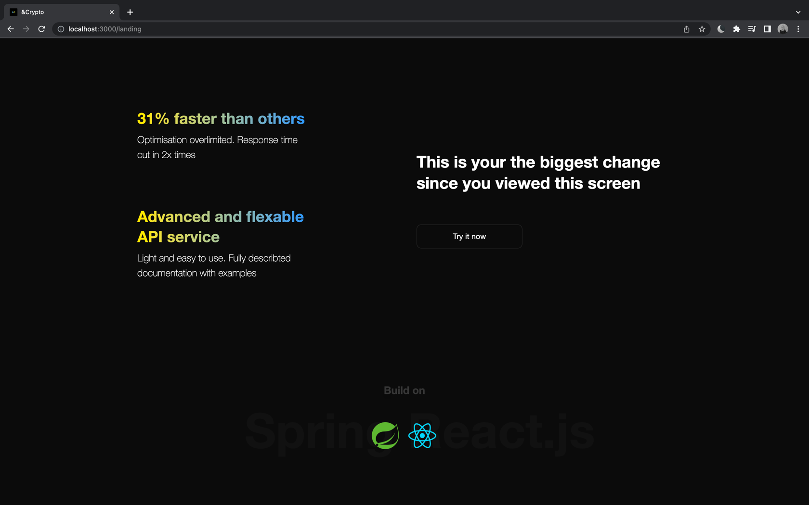
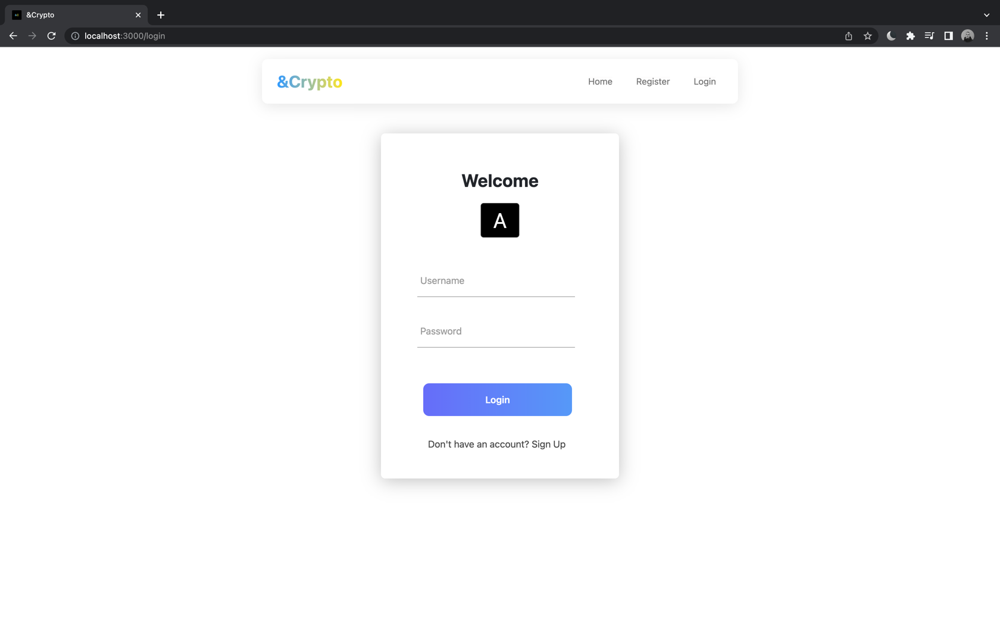
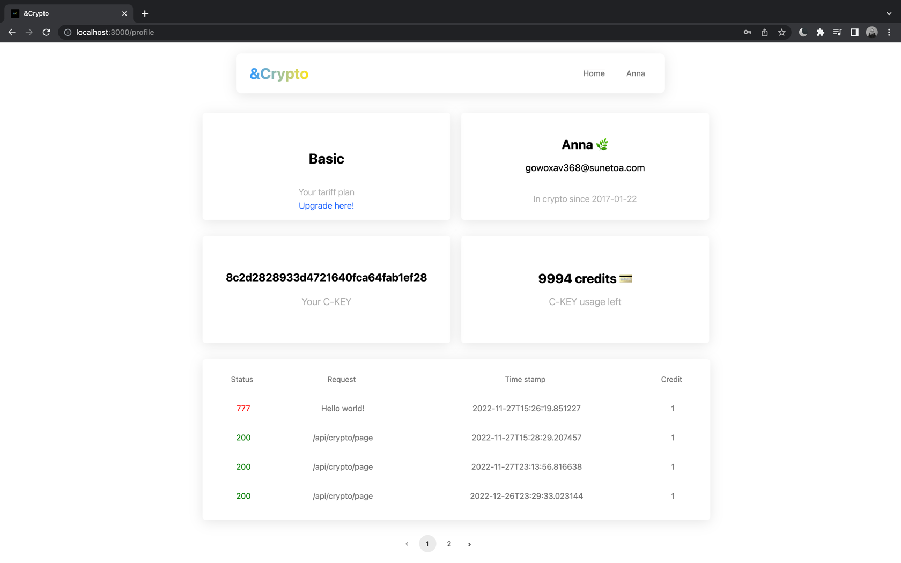
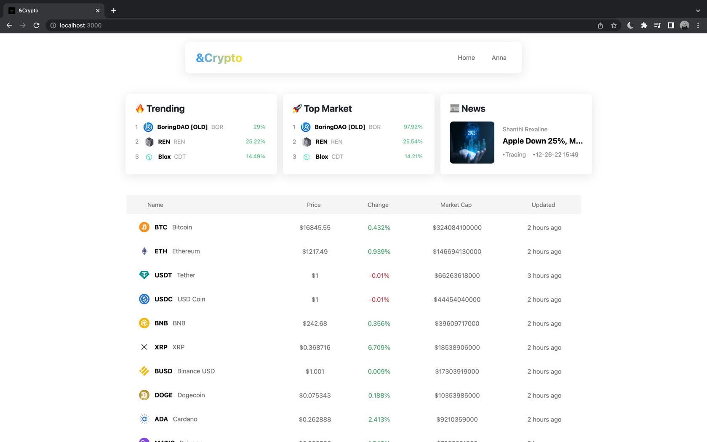
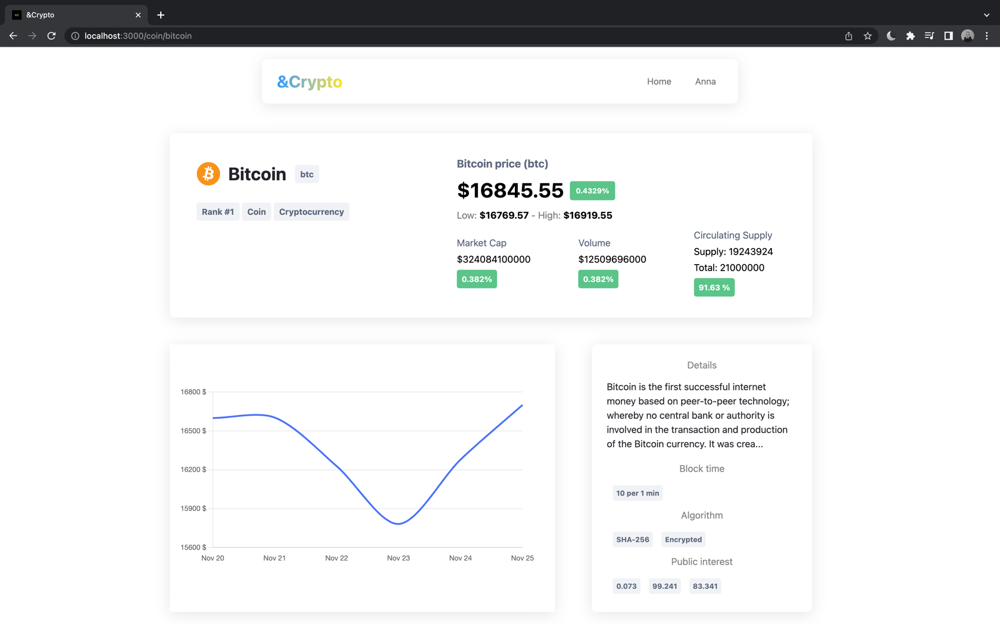

# &CRYPTO [Front-end][DEMO]

Developed a web application that can
to be used in the Internet of Things network for efficient processing and distribution of information about the cryptocurrency market and more detailed information about individual cryptocurrencies.

### How to run 🚀

To get started you need to have the `Back-end` part installed on your machine.
To know how to run it you can visit the following 
[link](https://github.com/JessieCasey/Crypto-Open-API) (https://github.com/JessieCasey/Crypto-Open-API)

Then you can open the `Front-end` in your favorite IDE and type in the terminal the following command `npm install` & `npm start`.

### Congratulations

Congratulations! You've done everything correct 🎉

### 🌿 Start

Let's try to use it with our hands. Open your browser and type the following:

`http://localhost:3000/landing`

---

After scrolling the landing page you can find out the buttons which will redirect you to the application. However, you can open them directly with it:

You'll be asked to sign in, I've already signed up and confirmed my credentials via email.
Then you'll be redirected to your profile. You can find out your C-KEY.

Let's check the home page and the details about any cryptocurrency

That's all. Have a nice day and best wishes.
